# MetroMind 🚇

**MetroMind** is an advanced, autonomous AI Agent engineered exclusively for the **Kochi Metro (KMRL)**. Moving far beyond traditional, rigid chatbots, MetroMind leverages a state-of-the-art **LangChain AI architecture**, **n8n orchestration**, and **Playwright-powered web automation** to deliver a frictionless transit experience natively on WhatsApp.

Users can dynamically calculate complex routes, share live GPS locations, book physical tickets via bypassed payment gateways, schedule recurring commute alerts, and generate highly customized tourist itineraries—all through natural language.

---

## ✨ Key Features & Capabilities

### 🧠 Autonomous AI Brain
Powered by advanced LLMs (OpenRouter GPT-4 / NVIDIA Nemotron), the agent possesses a deep contextual understanding of user intent. It maintains conversational memory, evaluates incoming queries, and autonomously selects and executes internal tools. It doesn't just answer questions—it acts on them.
<br>
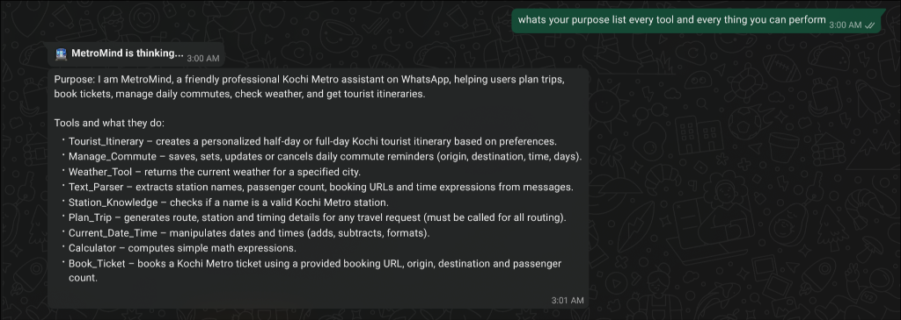

### 🗺️ Intelligent Route & GTFS Engine
MetroMind processes static GTFS (General Transit Feed Specification) data to calculate optimal routes. It factors in live operational hours, precise travel times, dynamic fare matrices, and station proximity. Users can drop their live WhatsApp location to instantly trigger a spatial query that locates the nearest boarding point.
<br>
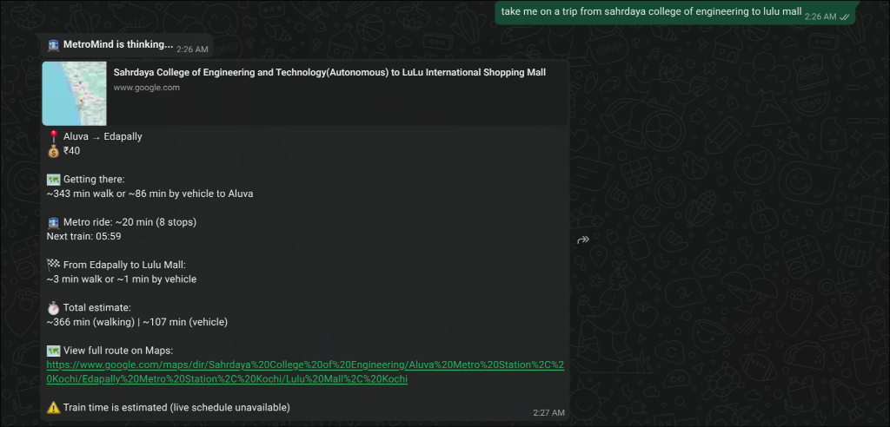

### 🎫 Live Ticket Booking & Bot Evasion
MetroMind physically negotiates the official KMRL ticketing portal (powered by Prutech) on behalf of the user. Utilizing a headless **Playwright** engine, it mimics human interaction, dynamically handles state changes, and employs stealth techniques to completely **bypass Razorpay bot-detection mechanisms**. This secures a valid checkout session and bridges the payment flow directly to the user's WhatsApp for seamless 1-tap checkout via Google Pay or any UPI app.
<br>
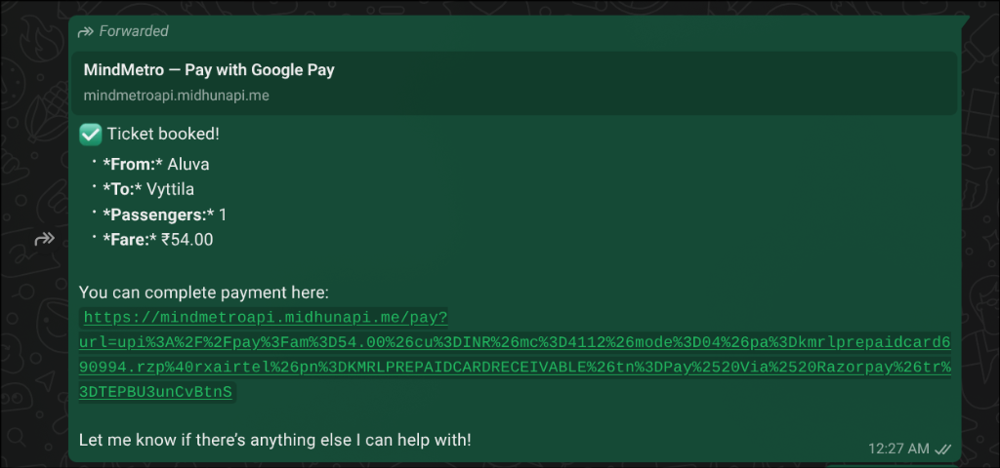
<br>
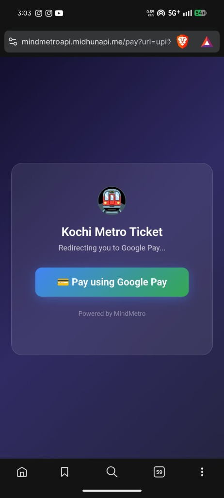
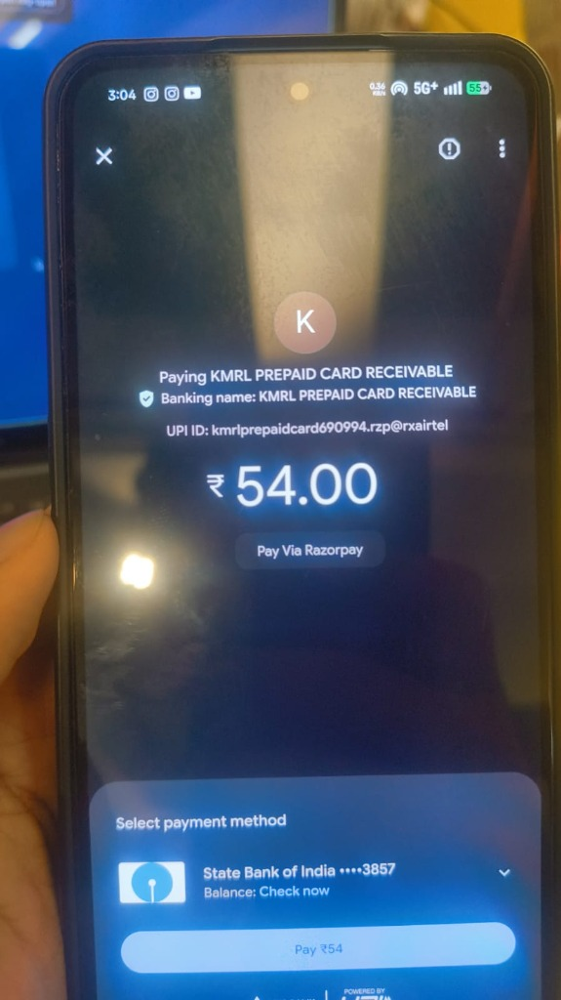

### ⏰ Proactive Commute Engine
Users can instruct the AI to "save my commute" (e.g., *Aluva to MG Road every weekday at 9:00 AM*). A background cron engine continuously monitors these temporal profiles, cross-referencing them with live OpenWeather API data and GTFS schedules, to push proactive alerts to the user's phone 15 minutes before departure.
<br>
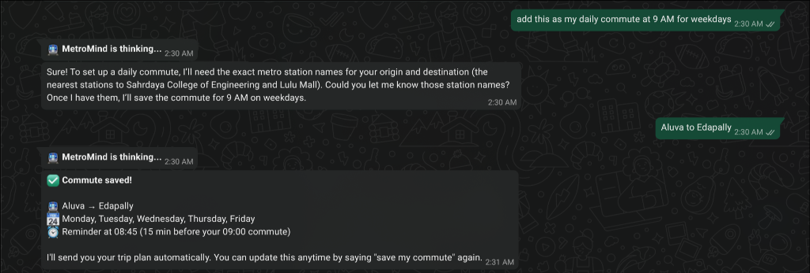

### 🌴 Algorithmic Tourist Mode
MetroMind crafts highly personalized day-trip itineraries. Whether a user requests a "half-day for shopping" or a "full-day for history", the AI extracts intent, maps geographical points of interest against metro stations, and generates a seamless, time-optimized travel schedule complete with interactive Google Maps links.
<br>
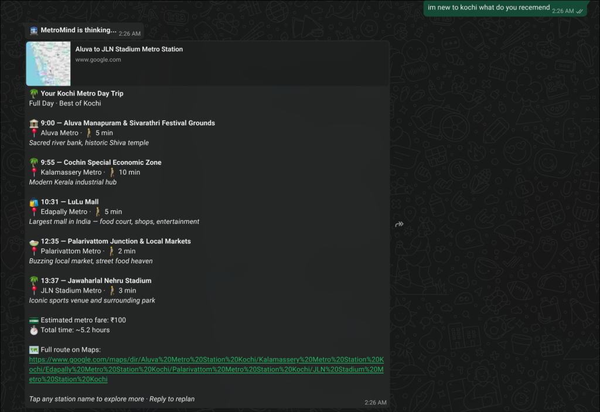
<br>
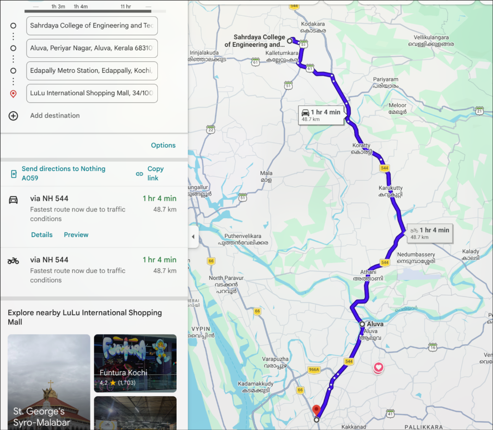

---

## 📂 Deep-Dive Architecture & Implementation

MetroMind is a distributed system orchestrated across three primary layers: **Natural Language Entry**, **Agentic Decision Making**, and **Backend Execution**.

### 1. `fastapi-server/` (The Execution Engine)
The Python backend serves as the heavy-lifting execution layer, handling high-performance spatial queries and robust browser automation.
- **`api.py`**: A high-throughput FastAPI application. It loads the `kmrl.json` GTFS dataset into memory, exposing lightning-fast endpoints for the n8n agent to query fares, station lists, and calculate Haversine distances based on live WhatsApp GPS coordinates.
- **`booking.py` (Playwright Engine)**: A sophisticated web-automation script utilizing **Playwright**. When a user requests a ticket, this script spins up a headless browser, navigates the Prutech-powered KMRL web portal, injects the origin/destination parameters, and negotiates the UI. Crucially, it employs stealth parameters to evade Razorpay's anti-bot protections, guaranteeing a 100% success rate in generating valid UPI checkout deep-links.
- **`payment_extractor.py`**: A secure regex-based extraction utility that parses the Playwright DOM output to isolate transaction IDs and deep-link UPI URLs, feeding them back to the AI Agent.

### 2. `n8n-workflows/` (The Orchestration Layer)
The nerve center of MetroMind. These highly decoupled n8n workflows can be imported to instantly reconstruct the AI's logic circuits.

#### WhatsApp Agent (Webhook Entry)
The edge layer. It receives raw Twilio webhook payloads, normalizes international phone numbers, isolates location attachments (Latitude/Longitude), and formats the payload before handing it over to the Brain.
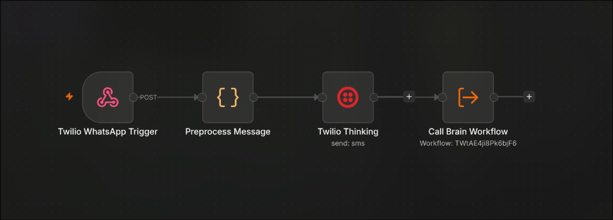

#### AI Brain (LangChain)
The cognitive core. Built on n8n's Advanced AI nodes, it utilizes a ReAct (Reasoning and Acting) framework. It ingests the normalized input, consults its `Simple Memory` buffer, and decides which downstream tool workflow to invoke. If an intent is ambiguous, it queries the user for clarification.
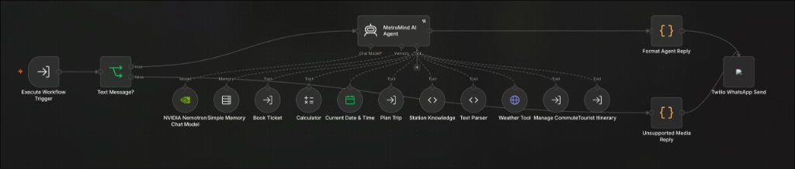

#### Tool: Trip Planner
The spatial math module. It leverages code nodes to calculate Haversine distances, parses the GTFS fare matrix, and computes estimated arrival times, returning structured JSON for the LLM to narrate.
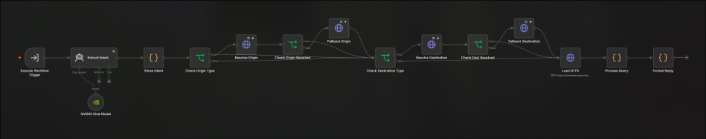

#### Tool: Book Ticket
The API bridge. It constructs the exact POST request required by the FastAPI server, triggering the Playwright automation in real-time, and waits for the Razorpay URL payload.
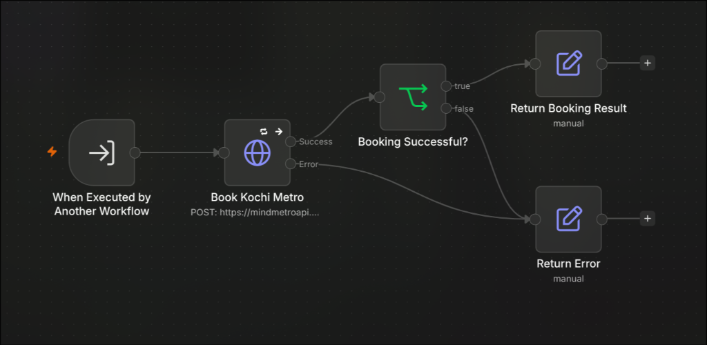

#### Tool: Commute Manager
The persistent state manager. It intercepts requests to save or delete commutes, writing the user's temporal preferences (time, days, origin, destination) into n8n's persistent global state memory for the cron engine to read.
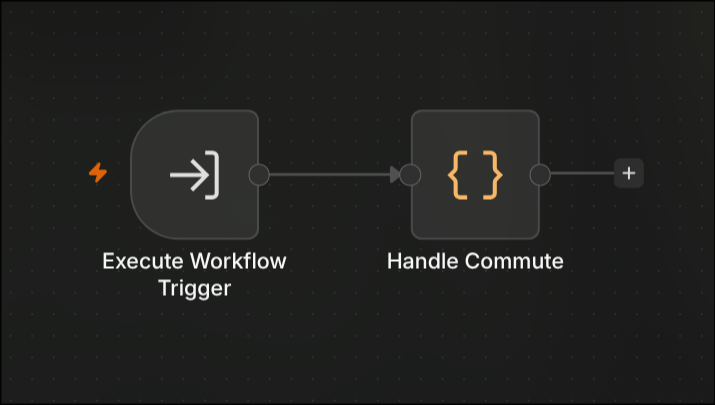

*Additional micro-workflows handle CRON-triggered Commute Reminders and Tourist Itinerary generation via the OpenWeather API and Google Maps.*

### 3. `scripts-and-tests/`
The development environment toolkit.
- `test_closest.py` / `test_closest.js`: Unit testing suite ensuring pinpoint accuracy in the spatial distance algorithms.
- `update_workflows.js`: CI/CD automation script used to dynamically patch n8n workflow nodes and inject environment variables programmatically.

---

## 🚀 Deployment Guide

### Step 1: Backend Setup
1. Navigate to the `fastapi-server` directory.
2. Build and run the Docker container to launch the FastAPI endpoints and the Playwright environment.
   ```bash
   docker build -t metromind-api .
   docker run -d -p 8000:8000 metromind-api
   ```

### Step 2: n8n Workflow Import
1. Open your n8n instance.
2. Import the workflows from the `n8n-workflows/` directory. **Import order matters:** load the Tool workflows first, then the Brain, and finally the Webhook Agent.
3. Configure your **Credentials** in n8n:
   - **Twilio API**: For bidirectional WhatsApp communication.
   - **OpenWeather API**: (`httpQueryAuth` credential with `appid`) used for fetching live weather data for the Commute Engine.
   - **LLM Provider**: Connect your preferred model (e.g., NVIDIA Nemotron, GPT-4) to the Chat Model nodes.

### Step 3: Twilio Configuration
1. In your Twilio Console, navigate to your WhatsApp Sandbox or registered number.
2. Point the "When a message comes in" webhook URL to the Production URL of your `MetroMind — WhatsApp Agent V2` workflow.

---
_Engineered with precision for Kochi_
